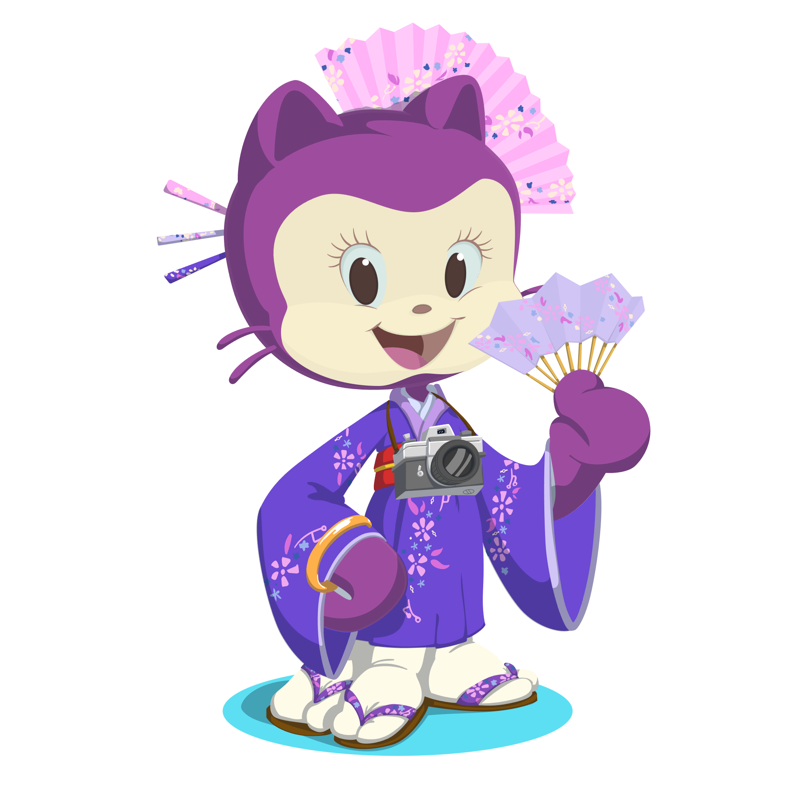

<!--- Intro -->

  
  
  <h1>Hi, I'm Azlin Liana!</h1>
  
  <h3>🚀 Full-Stack Developer | 🎓 Software Engineering Graduate | 🌱 Always Building & Learning</h3>

  
    
    <i>Crafting scalable, adaptable systems – from robust back-end logic to intuitive, impactful front-end. Clean code advocate. Purposeful designer. Relentless problem solver.</i>
  

 

<!--- Contact -->

  
  &nbsp;&nbsp;

  
  &nbsp;&nbsp;

  
  &nbsp;&nbsp;

  

 

<!--- About -->

  <h1 align="center">About Me</h1>

  

  <ul>
    <li>🔭 I’m currently working on <strong>refining my backend skills</strong></li>
    <li>🌱 I’m currently learning <strong>Node.js</strong></li>
    <li>⚡ Fun fact: <strong>I take my time building things — because solid, reliable code is always worth it 🪄</strong></li>
    <li>💬 I enjoy talking about <strong>backend architecture, clean code, and developer workflows</strong></li>
    <li>🛠️ I’m experimenting with <strong>APIs, databases, and full-stack feature building</strong></li>
    <li>📚 I learn best by <strong>building things, breaking them, and fixing them again</strong></li>
    <li>🎯 I’m interested in <strong>open-source, but still learning the ropes before jumping in</strong></li>
    <li>🚧 I’m getting more comfortable with <strong>DevOps and deployment workflows</strong></li>
    <li>📎 I’m guilty of <strong>overthinking variable names — clarity matters 😅</strong></li>
    <li>🎨 Outside of code, I’m into <strong>design, cute things like Molang 🐰, slaying in Mobile Legends 🎮, and bingeing Netflix 🎬</strong></li>
  </ul>

<!--- Tech -->

  <h1>My Skillset at a Glance</h1>
  
  <h3>🎨 Front-End</h3>

  
  
  
  
  
  
  
  
  
  

    
  
  <h3>🧩 Back-End</h3>
  
  
  
  
  
  
  
  
  
  

    
  
  <h3>🚀 Tools & Platform</h3>
  
  
  
  
  
  
  
  

